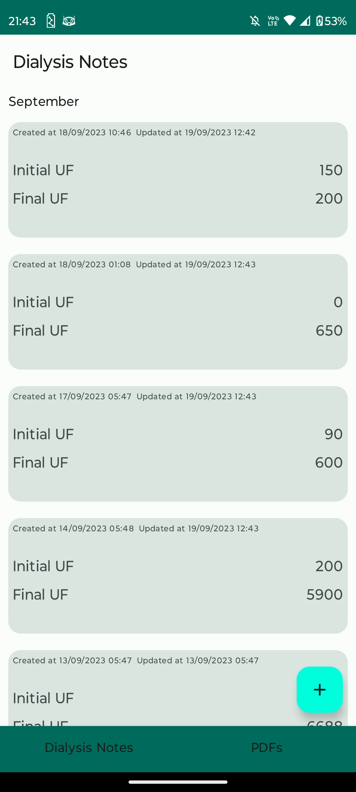
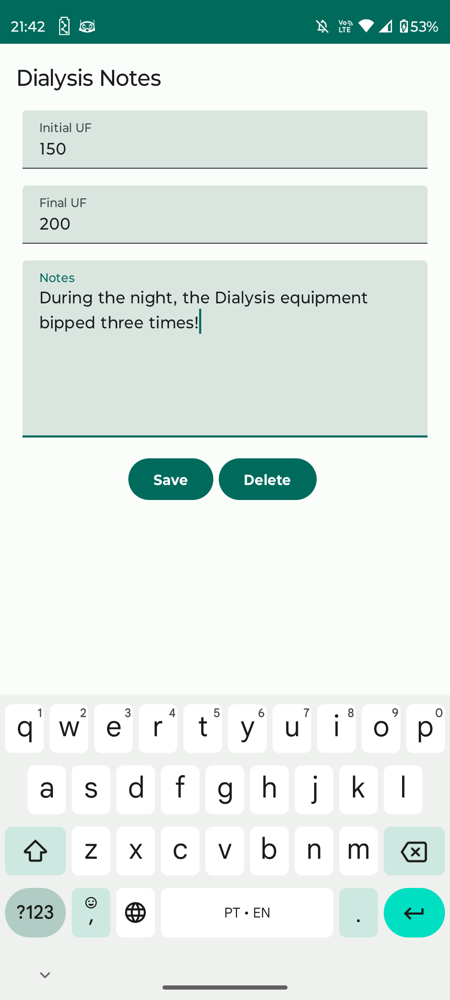
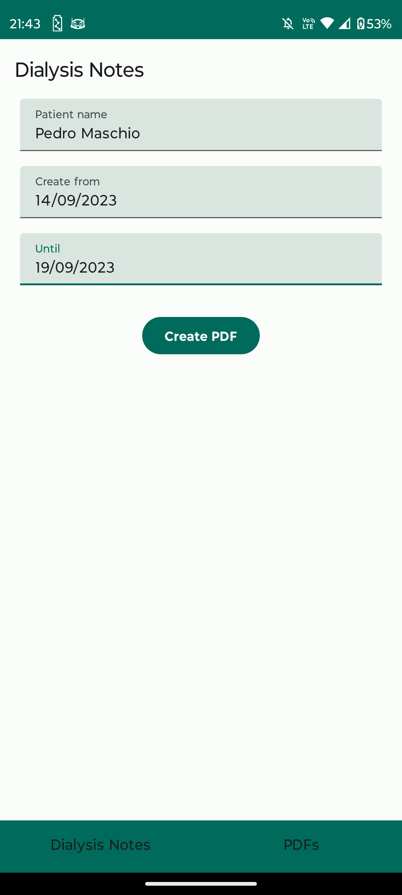
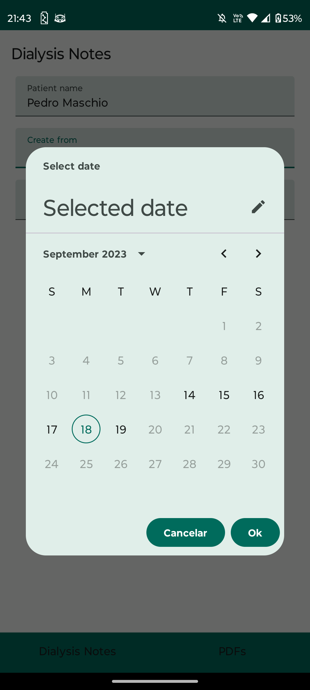
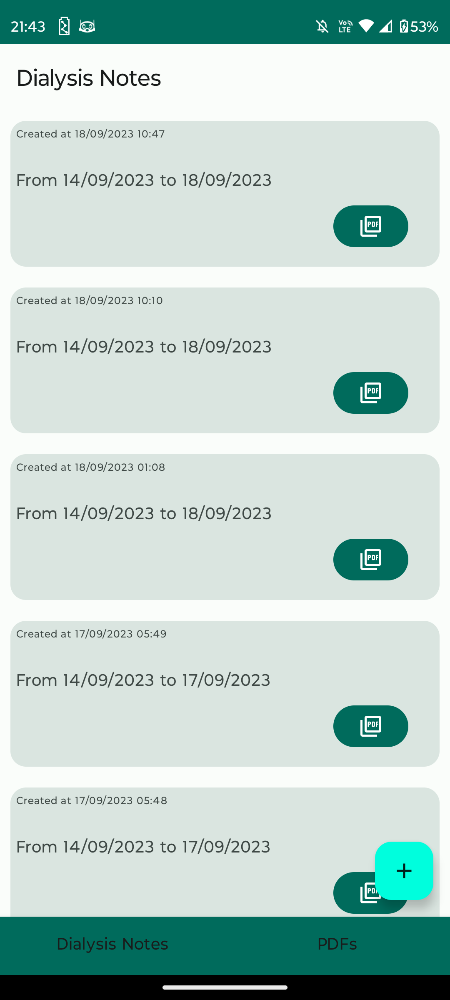

# dialysis

A simple Peritoneal dialysis tracker written completely in Kotlin using the principles of [modern app architecture](https://developer.android.com/topic/architecture) recommended by Google.

## Features
- Allows user to create and edit dialysis notes;
- Allows users to generate PDFs with the selected target interval locally;
- All data is stored in a Room database

### App created with sole purpose of learning - a lot of issues in the code yet

## What is missing

- [ ] Prepare the app to introduce testing
- [ ] Introduce testing itself
- [ ] Introduce dependency injection with Dagger
- [ ] Test it under performance constraints
- [ ] Introduce a backup mechanism. Maybe a new API? Should the app abandon offline mode only?

